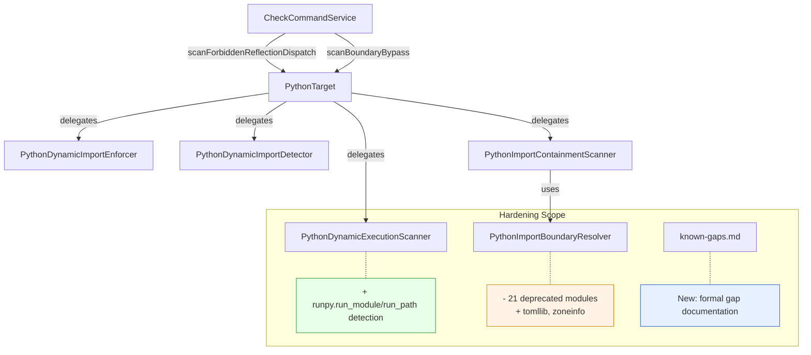
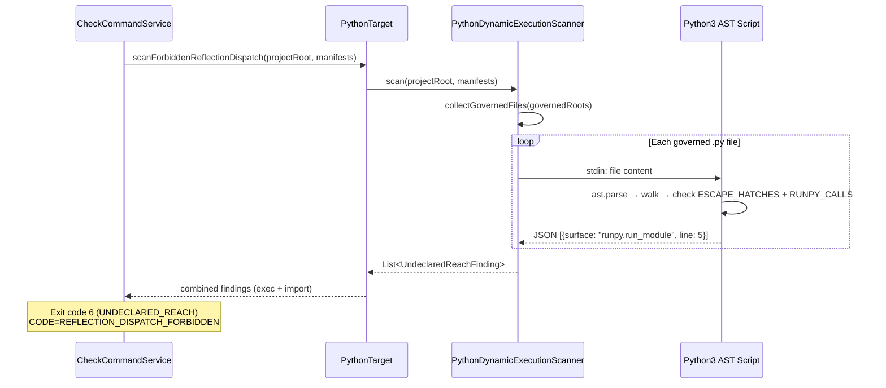

# Design Document: Python Target MVP Hardening

## Overview

This spec covers the remaining hardening work to bring the Python target to MVP quality. Phase P2 (Full Check Pipeline) is complete — all scanners work, TYPE_CHECKING exclusion is in place, test file exclusion is in place, and exit code mapping is correct. The deep research docs identified four focused gaps that need closing: `runpy` detection, deprecated stdlib cleanup, exit code mapping verification, and formal documentation of known detection gaps.

This is a surgical hardening pass, not a new feature. All changes are additive or corrective within existing scanner classes. No new exit codes, no new finding types, no new scanner classes.

## Architecture

The existing Python check pipeline already handles the full flow. This hardening pass touches three existing components and adds one documentation artifact.



## Sequence Diagram: runpy Detection Flow



## Components and Interfaces

### Component 1: PythonDynamicExecutionScanner (Modified)

**Purpose**: Detects dynamic code execution escape hatches in governed Python files.

**Current detection**: `eval`, `exec`, `compile` direct calls.

**Change**: Add `runpy.run_module` and `runpy.run_path` to the embedded Python AST script.

**Interface** (unchanged):
```java
public class PythonDynamicExecutionScanner {
    public static List<UndeclaredReachFinding> scan(
        Path projectRoot, List<WiringManifest> wiringManifests) throws IOException;
}
```

**Responsibilities**:
- Detect direct calls to `eval`, `exec`, `compile` (existing)
- Detect `runpy.run_module(...)` and `runpy.run_path(...)` calls (new)
- Exclude `if TYPE_CHECKING:` blocks (existing)
- Exclude test files (existing, via `collectGovernedFiles`)
- Return `UndeclaredReachFinding` with surface = `"runpy.run_module"` or `"runpy.run_path"`

### Component 2: PythonImportBoundaryResolver (Modified)

**Purpose**: Resolves Python imports and determines boundary violations. Contains the hard-coded `STDLIB_MODULES` set.

**Change**: Remove 21 deprecated/removed modules, add 2 new modules.

**Interface** (unchanged):
```java
public class PythonImportBoundaryResolver {
    public BoundaryDecision resolve(Path importingFile, String moduleName,
        boolean isRelative, Set<Path> governedRoots, Path projectRoot);
}
```

**Responsibilities**:
- Resolve relative and absolute imports (existing)
- Classify stdlib vs third-party vs BEAR-generated (existing)
- Maintain accurate `STDLIB_MODULES` set for Python 3.12+ (updated)

### Component 3: Exit Code Mapping (Verification Only)

**Purpose**: Verify that the P2 implementation correctly maps dynamic execution/import findings to exit code 6.

**Current state** (verified correct):
- `PythonTarget.scanForbiddenReflectionDispatch()` combines `PythonDynamicExecutionScanner` + `PythonDynamicImportEnforcer` findings
- Both return `UndeclaredReachFinding`
- `CheckCommandService` maps `scanForbiddenReflectionDispatch` → `EXIT_UNDECLARED_REACH` (6) with `CODE=REFLECTION_DISPATCH_FORBIDDEN`
- This is correct. No code change needed.

### Component 4: Known Detection Gaps Documentation (New)

**Purpose**: Formal documentation of bypass patterns that BEAR intentionally does not detect.

**Artifact**: `docs/context/python-known-gaps.md`

## Data Models

No new data models. All findings use the existing `UndeclaredReachFinding` record:

```java
public record UndeclaredReachFinding(String path, String surface) {}
```

New surface values added by this spec:
- `"runpy.run_module"` — from `PythonDynamicExecutionScanner`
- `"runpy.run_path"` — from `PythonDynamicExecutionScanner`

## Algorithmic Pseudocode

### runpy Detection (Addition to Embedded Python Script)

The existing `PythonDynamicExecutionScanner` Python script walks the AST looking for `ast.Call` nodes where `func` is an `ast.Name` in `ESCAPE_HATCHES`. The runpy detection adds a second check for `ast.Attribute` calls:

```java
// Addition to the embedded PYTHON_SCRIPT in PythonDynamicExecutionScanner.java
// Inside the ast.walk loop, after the existing ESCAPE_HATCHES check:

// Existing: detect eval/exec/compile
// if isinstance(node.func, ast.Name) and node.func.id in ESCAPE_HATCHES:
//     findings.append(...)

// NEW: detect runpy.run_module(...) and runpy.run_path(...)
// if isinstance(node.func, ast.Attribute):
//     if (isinstance(node.func.value, ast.Name) and
//         node.func.value.id == 'runpy' and
//         node.func.attr in ('run_module', 'run_path')):
//         findings.append({'surface': 'runpy.' + node.func.attr, 'line': node.lineno})
```

**Preconditions:**
- Source file parses without `SyntaxError`
- Node is an `ast.Call` with `lineno` not in `type_checking_lines`

**Postconditions:**
- `runpy.run_module(...)` → finding with surface `"runpy.run_module"`
- `runpy.run_path(...)` → finding with surface `"runpy.run_path"`
- No false positives on `runpy` attribute access without call (e.g., `x = runpy.run_module`)

**Loop Invariants:**
- All previously visited nodes have been checked against both `ESCAPE_HATCHES` and `RUNPY_CALLS`
- `type_checking_lines` set is immutable during walk

### STDLIB_MODULES Cleanup

```java
// In PythonImportBoundaryResolver.java, update STDLIB_MODULES:
//
// REMOVE (21 modules removed in Python 3.12/3.13):
//   aifc, audioop, cgi, cgitb, chunk, crypt, distutils, imghdr, imp,
//   mailcap, msilib, nis, nntplib, ossaudiodev, pipes, sndhdr, spwd,
//   sunau, telnetlib, uu, xdrlib
//
// ADD (already present but verify):
//   tomllib (added Python 3.11) — already in set ✓
//   zoneinfo (added Python 3.9) — already in set ✓
//
// Net change: remove 21 entries, add 0 (both new modules already present)
```

**Preconditions:**
- `STDLIB_MODULES` is a `Set.of(...)` immutable set

**Postconditions:**
- Set contains no modules removed in Python 3.12 or 3.13
- Set contains `tomllib` and `zoneinfo`
- All other entries unchanged

## Key Functions with Formal Specifications

### Function 1: PythonDynamicExecutionScanner.scan() (Modified)

```java
public static List<UndeclaredReachFinding> scan(
    Path projectRoot, List<WiringManifest> wiringManifests) throws IOException
```

**Preconditions:**
- `projectRoot` is a valid directory
- `wiringManifests` is non-null (may be empty)
- `python3` is available on PATH

**Postconditions:**
- Returns findings for `eval`, `exec`, `compile`, `runpy.run_module`, `runpy.run_path`
- Findings sorted by `path` ascending, then `surface` ascending
- No findings from `TYPE_CHECKING` blocks
- No findings from test files (`test_*.py`, `*_test.py`)
- No findings from non-governed files

### Function 2: PythonImportBoundaryResolver.isStdlibModule() (Modified behavior)

```java
private boolean isStdlibModule(String moduleName)
```

**Preconditions:**
- `moduleName` is non-null, non-empty

**Postconditions:**
- Returns `true` for all Python 3.12+ stdlib modules
- Returns `false` for `distutils`, `imp`, `aifc`, `audioop`, `cgi`, `cgitb`, `chunk`, `crypt`, `imghdr`, `mailcap`, `msilib`, `nis`, `nntplib`, `ossaudiodev`, `pipes`, `sndhdr`, `spwd`, `sunau`, `telnetlib`, `uu`, `xdrlib`
- Returns `true` for `tomllib`, `zoneinfo`

## Example Usage

### runpy Detection

```python
# This governed file triggers two findings:
import runpy

# Finding: surface="runpy.run_module"
result = runpy.run_module("some_module")

# Finding: surface="runpy.run_path"
result = runpy.run_path("/path/to/script.py")
```

### runpy in TYPE_CHECKING (No Finding)

```python
from typing import TYPE_CHECKING

if TYPE_CHECKING:
    import runpy
    runpy.run_module("some_module")  # Excluded — no finding

# Outside TYPE_CHECKING — this DOES produce a finding:
import runpy
runpy.run_path("/path/to/script.py")
```

### Deprecated Module Now Classified as Third-Party

```python
# Before hardening: distutils classified as stdlib → ALLOWED
# After hardening: distutils not in STDLIB_MODULES → THIRD_PARTY_IMPORT → exit 7
import distutils  # Now fails with BOUNDARY_BYPASS
```

## Correctness Properties

### Property H1: runpy.run_module detection
∀ governed Python file f, if f contains `runpy.run_module(...)` outside TYPE_CHECKING → `PythonDynamicExecutionScanner.scan()` returns at least one finding with `surface == "runpy.run_module"`.

### Property H2: runpy.run_path detection
∀ governed Python file f, if f contains `runpy.run_path(...)` outside TYPE_CHECKING → `PythonDynamicExecutionScanner.scan()` returns at least one finding with `surface == "runpy.run_path"`.

### Property H3: runpy in TYPE_CHECKING excluded
∀ governed Python file f, if f contains `runpy.run_module(...)` or `runpy.run_path(...)` only inside `if TYPE_CHECKING:` → `PythonDynamicExecutionScanner.scan()` returns empty list for that file.

### Property H4: runpy in test files excluded
∀ test file t (`test_*.py` or `*_test.py`), regardless of content → `PythonDynamicExecutionScanner.scan()` produces no findings from t.

### Property H5: Deprecated modules not in STDLIB_MODULES
∀ module m ∈ {aifc, audioop, cgi, cgitb, chunk, crypt, distutils, imghdr, imp, mailcap, msilib, nis, nntplib, ossaudiodev, pipes, sndhdr, spwd, sunau, telnetlib, uu, xdrlib} → `isStdlibModule(m)` returns `false`.

### Property H6: New modules in STDLIB_MODULES
∀ module m ∈ {tomllib, zoneinfo} → `isStdlibModule(m)` returns `true`.

### Property H7: Existing detection unaffected
∀ governed Python file f containing `eval(...)`, `exec(...)`, or `compile(...)` outside TYPE_CHECKING → findings still produced with original surface names. (Regression guard.)

### Property H8: Exit code mapping correct
`scanForbiddenReflectionDispatch` findings (including new runpy findings) → `EXIT_UNDECLARED_REACH` (6) with `CODE=REFLECTION_DISPATCH_FORBIDDEN`. (Verification property — no code change, just confirmed by test.)

### Property H9: Finding sort order preserved
∀ result list from any scanner, findings are sorted by `path` ascending then `surface` ascending. (Regression guard.)

### Property H10: Deprecated module imports now fail boundary check
∀ governed Python file f with `import distutils` (or any removed module) → `PythonImportBoundaryResolver.resolve()` returns `BoundaryDecision.fail("THIRD_PARTY_IMPORT")`.

## Error Handling

### Error Scenario 1: runpy Detection on Syntax Error

**Condition**: Governed Python file has a syntax error
**Response**: Python AST script returns `[]` (empty findings), same as existing behavior
**Recovery**: No recovery needed — syntax errors are silently skipped (consistent with all other scanners)

### Error Scenario 2: python3 Not Available

**Condition**: `python3` not on PATH when running scanners
**Response**: `IOException` propagated up to `CheckCommandService`
**Recovery**: Existing error handling in `CheckCommandService` catches IOException

## Testing Strategy

### Unit Testing Approach

- Add `runpy.run_module` and `runpy.run_path` test cases to `PythonDynamicExecutionScannerTest.java`
- Add TYPE_CHECKING exclusion tests for runpy patterns
- Add test file exclusion tests for runpy patterns
- Add deprecated module tests to `PythonImportBoundaryResolverTest.java`
- Verify `tomllib` and `zoneinfo` remain classified as stdlib

### Property-Based Testing Approach

**Property Test Library**: Plain JUnit 5 parameterized tests with 100+ iterations (project convention).

- Properties H1-H4: Add to `DynamicExecutionProperties.java` (extend existing property 11)
- Properties H5-H6, H10: Add to new `StdlibModuleProperties.java` or extend existing boundary resolver properties
- Properties H7, H9: Regression guards in existing property test classes

### Integration Testing Approach

- Add `check-runpy` fixture project under `kernel/src/test/resources/fixtures/python/`
- Verify exit code 6 with `CODE=REFLECTION_DISPATCH_FORBIDDEN` for runpy findings
- Verify deprecated module import produces exit code 7 with `CODE=BOUNDARY_BYPASS`

## Dependencies

No new dependencies. All changes use existing infrastructure:
- Python 3 AST module (already required by all Python scanners)
- Plain JUnit 5 (project convention — no jqwik/assertj)
- Existing `UndeclaredReachFinding` record
- Existing `BoundaryDecision` model
- Existing `PythonImportContainmentScanner.computeGovernedRoots()` / `collectGovernedFiles()`

## Known Detection Gaps (To Be Documented)

The following patterns are intentionally NOT detected by BEAR's Python scanners. These are documented as accepted limitations, not bugs. BEAR's threat model is "prevent accidental boundary expansion by well-intentioned agent code," not "prevent adversarial code injection."

| Gap | Example | Reason Not Detected |
|-----|---------|-------------------|
| `builtins.exec/eval` indirection | `builtins.exec("code")` | High false-positive risk with legitimate `builtins` usage |
| `getattr` + string concatenation | `getattr(__import__("builtins"), "exec")("code")` | Requires data flow analysis; malware detection territory |
| `sys.modules` manipulation | `sys.modules["socket"] = obj` | Medium complexity; exotic pattern; future consideration |
| `globals()`/`locals()` injection | `globals()["socket"] = __import__("socket")` | Requires data flow analysis; out of scope |
| `compile` + `FunctionType` | `types.FunctionType(compile(...), globals())()` | Multi-step pattern; requires `compile` first (which IS detected) |
| Aliased dangerous function calls | `f = eval; f("code")` | Requires alias tracking / data flow; accepted gap |

This matches the detection level of Semgrep, Bandit, and tach — all industry-standard tools that focus on direct call patterns.
